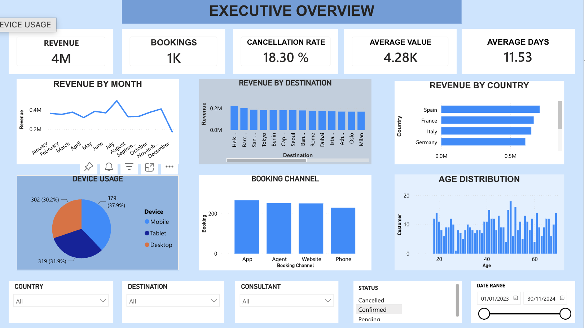
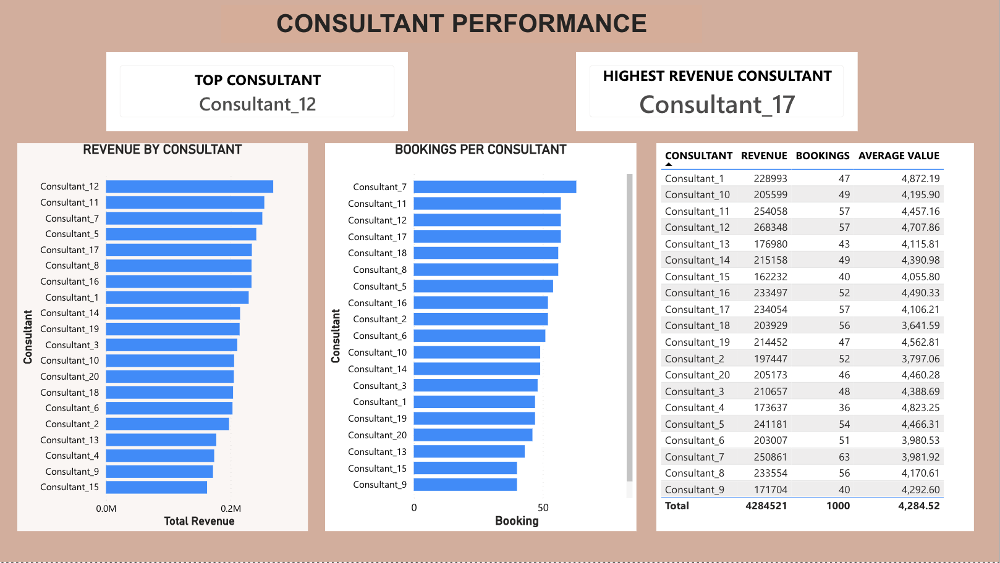
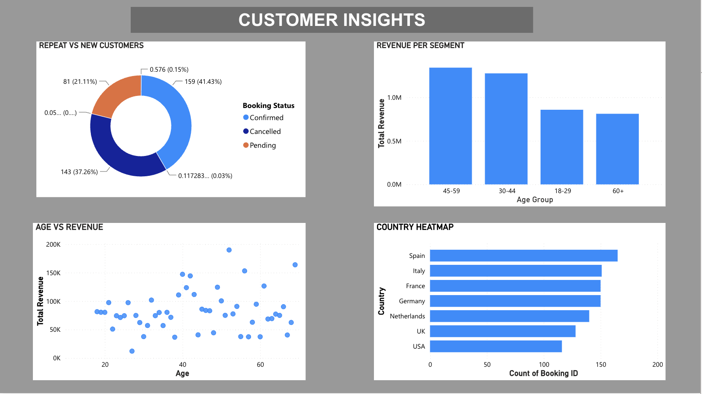
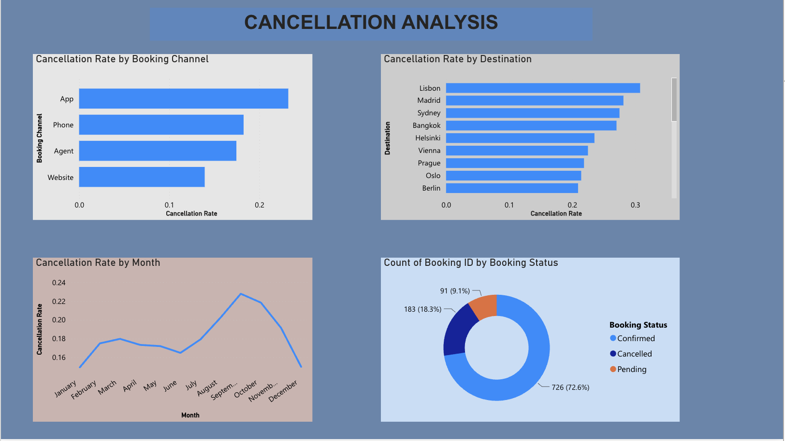

# Customer Travel Booking Analytics Dashboard

## Project Overview

I built this project to practice working with real-world style data from end to end. It covers 1,000+ customer travel bookings and looks at things like revenue trends, customer behavior, consultant performance, and cancellations. The idea was to go through the full analyst workflow: raw data, cleaning, querying, and finally a dashboard that someone in a business could actually use.

## The Problem I Was Solving

Travel companies have a lot of booking data but it is easy to lose track of what is actually driving revenue, which consultants are performing well, or why customers are cancelling. This project tries to answer those questions in one place.

## Tools I Used

- **Excel** for structuring the raw data into tables
- **Python (Pandas)** for cleaning the data, run in Google Colab
- **SQL (SQLite via DB Browser)** for writing business queries against the cleaned data
- **Power BI Service** for building the interactive dashboard
- **GitHub** for hosting the project

## Dataset

| Table | Rows | What it contains |
|---|---|---|
| Bookings | 1,000 | Revenue, dates, status, channel, consultant, destination, country, device, trip length |
| Customers | 500 | Age, gender, country, language |
| Consultants | 20 | Team, manager, experience level |
| Destinations | 25 | Region, average trip cost |

## What I Did

### Data Cleaning (Python)
I loaded each sheet as its own DataFrame, checked for missing values and duplicates, standardized the date columns, and exported clean CSVs ready for SQL and Power BI.

### SQL Analysis
I imported the cleaned data into a SQLite database and wrote 8 queries covering total revenue, revenue by country, cancellation rate, top destinations by bookings, consultant performance, average booking value, monthly trends, and booking channel breakdown.

### Power BI Dashboard
I imported all four tables, built relationships between them (Bookings connects to Customers, Consultants, and Destinations through their shared ID columns), and created custom DAX measures for cancellation rate, confirmation rate, repeat customer rate, and top consultant by revenue. The dashboard has four pages:

- **Executive Overview** covers the top KPIs, monthly revenue trends, and customer behavior
- **Consultant Performance** breaks down revenue and bookings by consultant
- **Customer Insights** looks at repeat vs new customers and revenue by age segment
- **Cancellation Analysis** shows where and when cancellations are happening

## Key Insights

- Spain generated the highest booking volume and revenue by country, followed by France and Italy, suggesting these markets should be prioritised for future campaigns.
- Consultant_12 was the top revenue generator at 228,993, while Consultant_7 handled the most bookings at 63, showing that booking volume and revenue performance do not always align across the team.
- Customers aged 45 to 59 generated the highest revenue by segment, making them the most valuable age group in this dataset.
- The App channel had both the highest usage and the highest cancellation rate at 18.30%, which is worth investigating since acquiring app users who then cancel has a direct cost impact.
- Lisbon had the highest cancellation rate of any destination, which could point to pricing, availability, or expectation issues specific to that market.
- 72.6% of all bookings were confirmed, with cancellations sitting at 18.3% and pending at 9.1%, giving a solid baseline for tracking improvement over time.

## Skills This Project Covers

- Data cleaning with Python and Pandas
- SQL querying for business analysis
- DAX measure writing in Power BI
- Dashboard design and layout
- KPI reporting
- Translating data into business insights

## Repo Structure

```
customer-travel-analytics-dashboard/
│
├── data/           cleaned CSV files
├── sql/            queries.sql
├── python/         data cleaning notebook
├── dashboard/      Power BI report
├── images/         dashboard screenshots
└── README.md
```

## Dashboard Preview

### Executive Overview


### Consultant Performance


### Customer Insights


### Cancellation Analysis


## Author

Edidiong Akama
